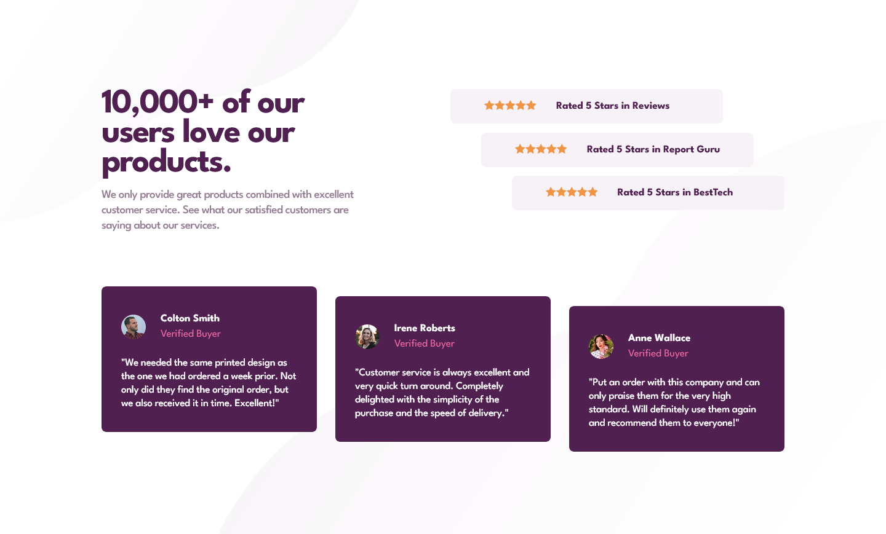
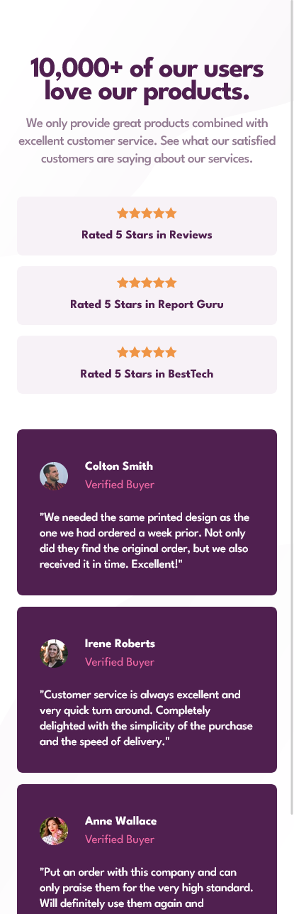

# Frontend Mentor - Social proof section solution

This is a solution to the [Social proof section challenge on Frontend Mentor](https://www.frontendmentor.io/challenges/social-proof-section-6e0qTv_bA). Frontend Mentor challenges help you improve your coding skills by building realistic projects. 

## Table of contents

- [Overview](#overview)
  - [The challenge](#the-challenge)
  - [Screenshot](#screenshot)
  - [Links](#links)
- [My process](#my-process)
  - [Built with](#built-with)
  - [What I learned](#what-i-learned)
- [Author](#author)

## Overview

### The challenge

Users should be able to:

- View the optimal layout for the section depending on their device's screen size

### Screenshot

### Links

- Solution URL: [Frontend Mentor solution page](https://www.frontendmentor.io/solutions/responsive-social-proof-section-challenge-ywNlf_P2ZK)
- Live Site URL: [lairdfire.github.io/social-proof-section/](lairdfire.github.io/social-proof-section/)

## My process

### Built with

- Semantic HTML5 markup
- CSS custom properties
- Flexbox
- Mobile-first workflow

### What I learned

This challenge pushed me out of my comfort zone, also was a good reminder for certain practice as well as solidifying my skills.

## Author

- Github - [Lairdfire](https://github.com/Lairdfire/)
- Frontend Mentor - [Lairdfire](https://www.frontendmentor.io/profile/Lairdfire)